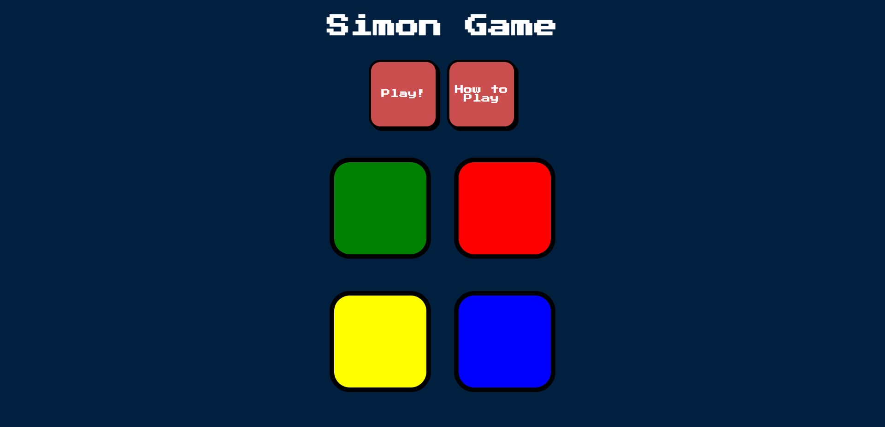

# Simon Game

Click the link to play!
https://simon-game-8gva.onrender.com

**Simon Game** is a classic memory game where the player must remember and repeat a sequence of colors and sounds. It's a fun and challenging way to test your memory and concentration skills. This web-based version of the game is built using HTML, CSS, and JavaScript.

## How to Play

The objective of the Simon Game is to remember and repeat a growing sequence of colors and sounds. Here's how to play:

1. Start the game by clicking the "Play!" button.
2. The game will start with a single color flashing.
3. Click the color to repeat the sequence.
4. The game will add another color to the sequence.
5. Repeat the sequence by clicking the colors in the correct order.
6. The game will continue to add colors as long as you repeat the sequence correctly.
7. If you make a mistake and click the wrong color, you'll hear a fail sound and see a game over message.
8. Click the game over message to restart the game and try to beat your high score.

Have fun testing your memory and reflexes with the Simon Game!

## Features

- Classic Simon Game experience.
- Challenging gameplay that tests your memory.
- User-friendly interface with colorful buttons and clear instructions.
- Sound effects to enhance the gaming experience.
- Responsive design for both desktop and mobile devices.
- How to Play modal for easy instructions.

## Game Controls

- Click the "Play!" button to start the game.
- Click the colored buttons to repeat the sequence.
- If you make a mistake, click the game over message to restart.
